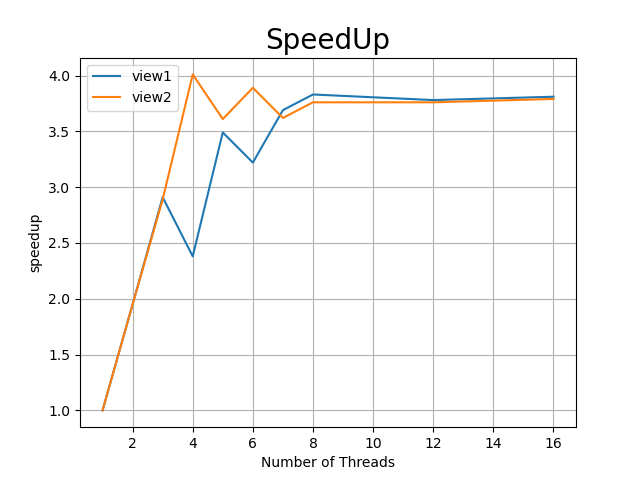

# Assignment 1: Performance Analysis on a Quad-Core CPU

The original handout is [here](./Handout.md).
以下是我对各个问题的理解，以及 handout 里提到的问题的解答。参考了 [PKUFlyingPig 的解答](https://github.com/PKUFlyingPig/asst1)
我的本机是2018年的 macbook pro, CPU 是 1.4 GHz, 4 core, Intel Core i5，我在跑的时候往往还开了微信/Chrome/VSCode，性能仅供参考；为了更好的展示结果，还在 AWS 的服务器上跑。

## Program 1: Parallel Fractal Generation Using Threads 

这题是要绘制一个图像，图象上每个像素代表一个复数，其亮度代表判断这个复数是否属于 [Mandelbrot set](https://en.wikipedia.org/wiki/Mandelbrot_set) 所需要的计算量。具体的代码就是，给定一个方形区间以及输出图片的宽度`x0, y0, x1, y1, width, height`, 对其中每个点运行一个函数 `mandel` 来判断其亮度。简单来说就是一个二层的循环，循环里不同点运行函数的 cost 不同，可以从给定的图片里直观的判断 cost 比较大的点的分布。view1 和 view2 绘制的是不同的区间，虽然输出的图片大小一直，但是点的 cost 分布不同。
```c++
for(i 0...n)
  for(j 0...n)
    f(i, j)
```

Q1.1 & 1.2: 使用 `thread` 来优化程序。不同线程在不同 view 上的 speedup 如下图。可以看到，不管是 View1 还是 View2，随着线程数量的增加，性能都是上升的。在具体实现里，我们是第 i 个线程负责绘制 i % numThreads 行的图像，这是为了努力让各个线程的工作均匀一些。

补充一下在 AWS 上4核8线程上跑的结果可以看到，小于4之前是很完美的线性上升；之后也基本是线性地到达了 7.3x 左右，然后就无法再进一步提升了
> view1
(2.00x speedup from 2 threads)
(3.00x speedup from 3 threads)
(4.00x speedup from 4 threads)
(4.63x speedup from 5 threads)
(5.55x speedup from 6 threads)
(6.47x speedup from 7 threads)
(7.37x speedup from 8 threads)
(6.51x speedup from 12 threads)
(7.01x speedup from 16 threads)
view2
(2.00x speedup from 2 threads)
(3.00x speedup from 3 threads)
(3.99x speedup from 4 threads)
(4.55x speedup from 5 threads)
(5.45x speedup from 6 threads)
(6.33x speedup from 7 threads)
(7.23x speedup from 8 threads)
(5.90x speedup from 12 threads)
(7.17x speedup from 16 threads)

Q1.3: 我们来具体分析一下两个view中，不同线程所用的时间(如果使用8线程)。很明显的可以看到，imbalance work assignment 限制了我们进一步提升性能，尽管我们已经试图尽可能公平分配了。
> view1中各个线程的耗时
thread[1]:		[110.281] ms
thread[2]:		[122.954] ms
thread[3]:		[123.680] ms
thread[7]:		[121.583] ms
thread[6]:		[123.143] ms
thread[4]:		[125.528] ms
thread[5]:		[130.555] ms
thread[0]:		[171.176] ms
view2中各个线程的耗时
thread[2]:		[46.715] ms
thread[4]:		[51.341] ms
thread[3]:		[60.360] ms
thread[1]:		[65.535] ms
thread[5]:		[35.381] ms
thread[6]:		[35.272] ms
thread[7]:		[35.730] ms
thread[0]:		[63.667] ms
AWS机器上8线程各个线程的耗时
thread[1]:		[75.175] ms
thread[2]:		[75.253] ms
thread[3]:		[75.274] ms
thread[7]:		[75.183] ms
thread[6]:		[75.259] ms
thread[5]:		[75.315] ms
thread[4]:		[75.355] ms
thread[0]:		[75.516] ms

Q1.4: 如果使用12或者16个线程，我们的性能不用有太大的改善，毕竟我们这是4核的机器，每个核最多运行两个线程。本机最终实验结果如下
> view1: 8 threads: 3.32x; 12 threads: 3.88x; 16 threads: 3.66x
view2: 8 threads: 3.21x; 12 threads: 3.86x; 16 threads: 3.58x.

## Program 2: Vectorizing Code Using SIMD Intrinsics

这题是要我们优化带有分支的循环。题目给我们提供了一些函数，让我们假装这些函数是底层的指令，用这些指令去重写原来的串行函数，从而优化指令的数量。
`make clean && make MYCFLAGS="-DVECTOR_WIDTH=8"` 关于 make 补充一些，我现在意识到使用宏做实验是一件多么麻烦的事情，要想一切都放到 `run.sh` 中跑我们就要使用这么丑陋的方式。
利用`-s`设置循环1000次，不同的 vector width 的结果如下。可以得到的结论，随着 VECTOR_WIDTH 的增加，总指令数是下降的，但是指令的利用率也在下降。
> VVector Width    Total Vector Instructions       Vector Utilization      Utilized Vector Lanes  Total Vector Lanes
2       162823  87.8%   285761  325646
4       94559   82.5%   312059  378236
6       66707   80.7%   323101  400242
8       51535   79.8%   329087  412280
10      41983   79.3%   332865  419830
12      35363   79.0%   335238  424356
14      30659   78.7%   337684  429226
16      26951   78.5%   338567  431216

## Program 3: Parallel Fractal Generation Using ISPC

这里提供了一个使用 ISPC 编程的例子。这里提到 ISPC program 总是利用 SIMD 单元并发执行。并且并发的数量是由编译器根据底层机器决定(可以在程序里调用变量 programCount 得到)。ISPC code 可以通过变量 programIndex 查看 index. C 调用依次 ISPC 函数可以被视为调用了一组并发的 ISPC instances(一组被称为 a gang of instances)。

我们不需要自己写代码，只需要运行，然后感受一下 speedup 就可以了。考虑这里 ISPC 编译器会生成 8-wide AVX2 vector instructions，我们最多获得8倍的的提速，而事实上我在本机上获得了 5.06x/4.28x 的提速(对应 view1/2)。view2之所以更差劲的原因应该是，view1中 cost 比较多的点都聚在一起了，而 view2中则比较分散，这就会导致 empty lanes 的增加。

使用 2 个 task 之后，则可以获得 10.02x/7.22x 的 speedup。这里就可以看到基本上使用 task 可以 double performance。
再做一个实验，对比不同 task 数量获得的 speedup。其实每次都会有一些误差，但基本上 view1最高就是18x，view2最高就是16x，最佳的 task 数量我认为是 8，因为我们实际上最多跑8个线程嘛。
> 2: 10.02x/7.22x; 
4: 12.21x/9.80x; 
8: 13.67x/12.98x; 
16: 15.59x/14.97x;
32: 16.18x/15.06x

另外Extra Credit中让我们比较 thread 和 task。这个课上老师提过，thread 并不是一个抽象，而是真的存在的一个东西，创建/调度/销毁都是需要代价的；而 task 则是一个抽象，底层可能就是一堆 function，然后由一个调度器去分发给不同的 thread。因此创建10000个 task会带来不必要的存储和调度开销，但这个开销依然可以接受；而创建10000个 thread我的小破 mac 必然会死掉。

## Program 4: Iterative sqrt

这题和第三题类似，函数的内容是利用牛顿法求解根号的近似值，我们要求N个数的近似解。
```c++
// 如果在0~3之间随机初始化
values[i] = .001f + 2.998f * static_cast<float>(rand()) / RAND_MAX;
// 结果：4.52x from ISPC, 17.04x from task ISPC

// 如果要 maximize speedup, 那么所有的数都是2.998f
// 所有数字都一样保证利用率是100%，2.998f 来保证计算时间更长，那么其余串行时间占比更短
values[i] = 2.998f;
// 结果：7.15x from ISPC，26.11x from task ISPC

// 如果要 minimize speedup，那么所有的数都1，而 index 是8的倍数的数是2.998f
// 这样保证每个指令的empty lane 是最多的，speedup 是最小的
values[i] = 1.;
if (i % 8 == 0) { values[i] = 2.999f; }
// 结果：0.96x from ISPC， 3.04x from task ISPC
```

关于 extraCredit, 具体可以看代码，这里提几个点：
```c++
// _mm256_cmp_ps：如果大于，则把对应的 bit 全部置1
gt = _mm256_cmp_ps(error, kThre, _CMP_GT_OQ);
// _mm256_movemask_ps：把8个符号位移动到一个 mask
unsigned mask = _mm256_movemask_ps(gt);
// _mm_popcnt_u32： 判断一个 u32里有多少位是1
while(_mm_popcnt_u32(mask))  // 等价于 while (error > kThreshold) 
```

## Program5 BLAS saxpy

这里是为了计算 `result[i] = scale * X[i] + Y[i];`，课上讲过，这里我们3个 load 操作对应一个计算操作，也就是这里限制 speedup 的是从内存 load 数据的 bandwidth, 没有很好的办法可以进一步提升
> [saxpy ispc]:           [14.066] ms     [21.188] GB/s   [2.844] GFLOPS
[saxpy task ispc]:      [10.691] ms     [27.875] GB/s   [3.741] GFLOPS
                                (1.32x speedup from use of tasks)

Extra Credit: 中问到了带宽具体怎么计算：
> Note that the total memory bandwidth consumed computation in main.cpp is TOTAL_BYTES = 4 * N * sizeof(float);. Even though saxpy loads one element from X, one element from Y, and writes one element to result the multiplier by 4 is correct. Why is this the case? (Hint, think about how CPU caches work.)
因为 `result[i]` 的读和写是两个步骤，对应的值要被加载到 cache line 里，等到不要的时候再被 flash 回去。

## Program6 Kmeans

这题分成几个步骤，首先是判断哪个函数才是瓶颈，计算每个函数的耗时，然后判断得到`computeAssignment`是瓶颈
> timeCost in computeAssignments: 26818.547560 ms
timeCost in computeCentroids: 3091.399237 ms
timeCost in computeCost: 8025.269914 ms
timeCost in Loop: 37935.238800 ms with 50 loop

使用多线程优化后得到。其实我不能做到稳定的高于2.1的 speedup。这是因为一方面另外两个函数也占用了比较多的时间,另一方面我感觉带宽限制了它，毕竟它的计算量不大。这个时候只需要参考 saxy 的优化方式就可以了。这部分还待深究。
> timeCost in computeAssignments: 8799.842296 ms
timeCost in computeCentroids: 3313.782487 ms
timeCost in computeCost: 7915.983906 ms
timeCost in Loop: 20029.625397 ms with 50 loop
[Total Time]: 20029.691 ms

在 AWS 上：
> Running K-means with: M=1000000, N=100, K=3, epsilon=0.100000
> timeCost in computeAssignments: 10677.558306 ms -> 2607.138757 ms
> timeCost in computeCentroids: 1732.437259 ms -> 1821.915000 ms
> timeCost in computeCost: 3247.904626 ms -> 3322.277883 ms
> timeCost in Loop: 15657.909376 ms with 24 loop -> 7751.339726 ms
> [Total Time]: 15674.907 ms -> 7768.758 ms
