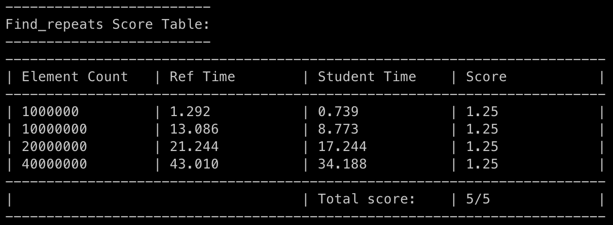
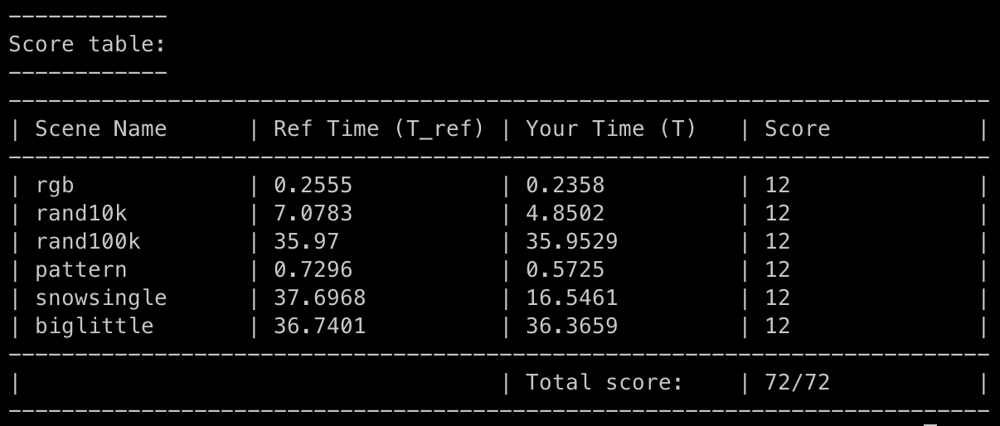

# Assignment 3: A Simple CUDA Renderer

## Part 1: CUDA Warm-Up 1: SAXPY

这里的代码和 tutorial 里提供的[代码](https://github.com/HeKun-NVIDIA/CUDA-Programming-Guide-in-Chinese/blob/main/%E7%AC%AC3%E7%AB%A0%E7%BC%96%E7%A8%8B%E6%8E%A5%E5%8F%A3/%E7%AC%AC%E4%B8%89%E7%AB%A0%E7%BC%96%E7%A8%8B%E6%8E%A5%E5%8F%A3.md#322-%E8%AE%BE%E5%A4%87%E5%AD%98%E5%82%A8)基本是一模一样。

### Question 1

**What performance do you observe compared to the sequential CPU-based implementation of SAXPY (recall your results from saxpy on Program 5 from Assignment 1)?**

因为一开始AWS 不让我申请 GPU 资源，所以我费劲千辛万苦找到了 V100的资源，后来 AWS 给我批了我又去 T40上跑了。
> (CPU) [saxpy ispc]:		[17.864] ms	[16.683] GB/s	[2.239] GFLOPS
[saxpy task ispc]:	[5.049] ms	[59.029] GB/s	[7.923] GFLOPS
(V100) Effective BW by CUDA saxpy: 345.795 ms          [3.232 GB/s]
Kernel BW by CUDA saxpy: 1.529 ms               [730.976 GB/s]
(T4) Effective BW by CUDA saxpy: 267.100 ms		[4.184 GB/s]
Kernel BW by CUDA saxpy: 4.792 ms		[233.207 GB/s]

### Question 2

**Compare and explain the difference between the results provided by two sets of timers (timing only the kernel execution vs. timing the entire process of moving data to the GPU and back in addition to the kernel execution). Are the bandwidth values observed roughly consistent with the reported bandwidths available to the different components of the machine? (You should use the web to track down the memory bandwidth of an NVIDIA T4 GPU. Hint: https://www.nvidia.com/content/dam/en-zz/Solutions/Data-Center/tesla-t4/t4-tensor-core-datasheet-951643.pdf. The expected bandwidth of memory bus of AWS is 4 GB/s, which does not match that of a 16-lane PCIe 3.0. Several factors prevent peak bandwidth, including CPU motherboard chipset performance and whether or not the host CPU memory used as the source of the transfer is “pinned” — the latter allows the GPU to directly access memory without going through virtual memory address translation. If you are interested, you can find more info here: https://kth.instructure.com/courses/12406/pages/optimizing-host-device-data-communication-i-pinned-host-memory)**

V100内存带宽最高是 900 GB/s, 我们到达了 730.976 GB/s, 属于 roughly consistent (不然我也分析不出理由了 orz)。
[T40](https://www.nvidia.com/content/dam/en-zz/Solutions/Data-Center/tesla-t4/t4-tensor-core-datasheet-951643.pdf.) GPU Memory 是300GB/s, 和我们233的结论也基本一致。
直接搜 linux bandwidth of memory bus，是可以查到如何搜索 Server 访问内存的带宽的。这里提到 我这里展示的带宽和 AWS 的差不多因此我就不深究了，我感觉大同小异，我们的结果(3.323 G/s)和4也基本吻合。

## Part 2: Parallel Prefix-Sum

### Exclusive Prefix Sum

这里比较简单的一点是，使用rounded_length来简化处理。所以只需要简单的把`README.md`的那段代码翻译成 CUDA 代码就可以了。另外的一点是，我希望 result 一开始可以是任意值，因此我引入了一个 copy 函数，把 input 的值复制过去。这是为了下面这个函数写起来更方便。另外我觉得这也更 make sense。

### Find Repeats

这里的基本思想是，首先一个循环，set some values to one；然后利用 exclusive prefix sum + 一个 find 函数把对应的 index 给找出来。这个思想在第三题里也会用到。

## Part 3

基本思路：

1. 每个 pixel 对应一个 thread，一个 block 对应图片里的正方形的部分。
2. 并发查询哪几个 circle 和当前 block 可能存在交集。另外使用 `circleInBoxConservative` 做一个粗筛，然后使用 `circleInBox` 做精筛。这里的 assumption 是，对大部分(block, circle)，我们使用代价更小的粗筛就可以快速判断它们必然没有交集。
3. 利用 find repeats 的想法，找到可能存在交集的 circle list，只对这个 list 里的 circle 做下一步计算。

另一个优化：不要每次都修改`imgPtr`。每次修改 thread local 变量 color，最后再修改`imgPtr`，减少访问内存的次数。

一个bug: `shadePixel` 那里是在循环外面 `__syncthreads`；如果在循环里面同步，会降低速度；如果忘了同步，会导致 shared 变量访问出错(这个课上好像提过，但是真的到了写代码的时候才意识到这个 bug 真的很恶心)。

做这个 lab 花了我1.12刀，心疼自己一秒钟。

### 参考资料中文版：[CUDA 编程手册](https://github.com/HeKun-NVIDIA/CUDA-Programming-Guide-in-Chinese)
