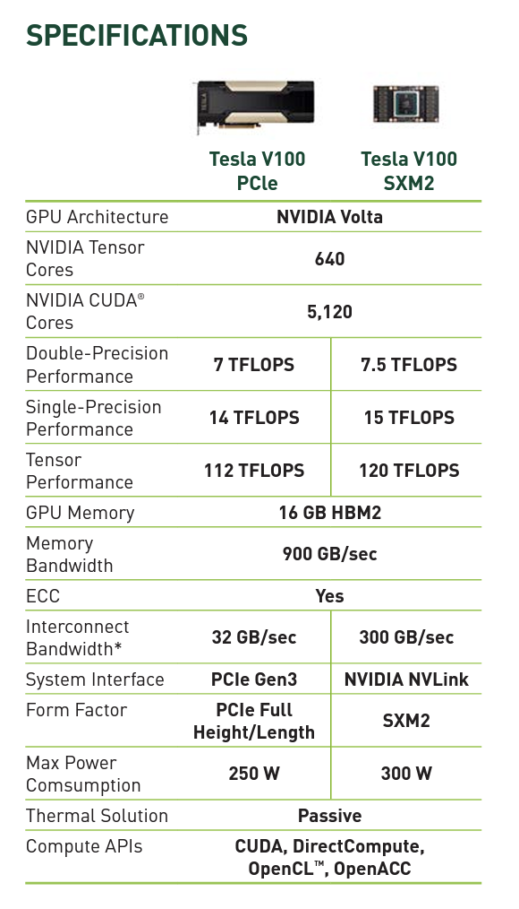

# Assignment 3: A Simple CUDA Renderer

## Part 1: CUDA Warm-Up 1: SAXPY
这里的代码和 tutorial 里提供的[代码](https://github.com/HeKun-NVIDIA/CUDA-Programming-Guide-in-Chinese/blob/main/%E7%AC%AC3%E7%AB%A0%E7%BC%96%E7%A8%8B%E6%8E%A5%E5%8F%A3/%E7%AC%AC%E4%B8%89%E7%AB%A0%E7%BC%96%E7%A8%8B%E6%8E%A5%E5%8F%A3.md#322-%E8%AE%BE%E5%A4%87%E5%AD%98%E5%82%A8)基本是一模一样。

### Question 1. What performance do you observe compared to the sequential CPU-based implementation of SAXPY (recall your results from saxpy on Program 5 from Assignment 1)?

由于 AWS 申请资源的那一步出了问题，没法申请 AWS 的 GPU；实在不会操作又害怕自己不小心背负巨额债务，所以只好在实验室的 V100 上跑了(配环境配了半天，有条件还是应该去申请可以 sudo 的服务器)。对比一下 AWS m5.2x 上的结果，可以看到 GPU 跑的确实快，但 CPU 和 GPU 的数据通信比较慢。
> (AWS) [saxpy ispc]:		[17.864] ms	[16.683] GB/s	[2.239] GFLOPS
[saxpy task ispc]:	[5.049] ms	[59.029] GB/s	[7.923] GFLOPS
(V100) Effective BW by CUDA saxpy: 345.795 ms          [3.232 GB/s]
Kernel BW by CUDA saxpy: 1.529 ms               [730.976 GB/s]

### Question 2. Compare and explain the difference between the results provided by two sets of timers (timing only the kernel execution vs. timing the entire process of moving data to the GPU and back in addition to the kernel execution). Are the bandwidth values observed roughly consistent with the reported bandwidths available to the different components of the machine? (You should use the web to track down the memory bandwidth of an NVIDIA T4 GPU. Hint: https://www.nvidia.com/content/dam/en-zz/Solutions/Data-Center/tesla-t4/t4-tensor-core-datasheet-951643.pdf. The expected bandwidth of memory bus of AWS is 4 GB/s, which does not match that of a 16-lane PCIe 3.0. Several factors prevent peak bandwidth, including CPU motherboard chipset performance and whether or not the host CPU memory used as the source of the transfer is “pinned” — the latter allows the GPU to directly access memory without going through virtual memory address translation. If you are interested, you can find more info here: https://kth.instructure.com/courses/12406/pages/optimizing-host-device-data-communication-i-pinned-host-memory)

内存带宽最高是 900 GB/s, 我们到达了 730.976 GB/s, 属于 roughly consistent (不然我也分析不出理由了 orz)。
直接搜 linux bandwidth of memory bus，是可以查到如何搜索 Server 访问内存的带宽的。这里提到 我这里展示的带宽和 AWS 的差不多因此我就不深究了，我感觉大同小异，我们的结果(3.323 G/s)和4也基本吻合。

另外由于我用的是 V100，之后 `Makefile` 里应该都用`compute_70`。这也决定了TA 预先编译好的所有`X_ref`文件都没法执行，我只能和学弟的代码进行比较了。

## 参考资料中文版：[CUDA 编程手册](https://github.com/HeKun-NVIDIA/CUDA-Programming-Guide-in-Chinese)